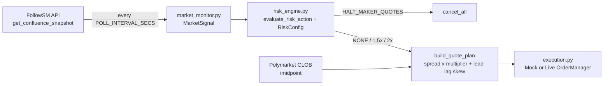

# Polymarket Arbitrage Starter Kit

[](https://pypi.org/project/followsm-sdk/)
[](https://colab.research.google.com/github/Follow-SM/polymarket-arbitrage-starter-kit/blob/main/quickstart.ipynb)
[](https://follow-sm.com/pricing)
[](LICENSE)

An asynchronous Python market-making bot for **Polymarket CLOB** that uses **Binance spot microstructure** as its risk signal. It is built on [`followsm-sdk`](https://pypi.org/project/followsm-sdk/).

Binance spot usually reprices before crypto prediction markets do. This bot uses that lead in two ways:

1. **Defence.** It pulls or widens its Polymarket maker quotes when Binance order flow turns toxic (high VPIN, one-sided 1% depth) or when the two venues disagree.
2. **Offence.** It skews its quotes toward the spot-implied fair value before the prediction market catches up.

```
2026-09-26 10:53:07 INFO bot | BTCUSDT vpin=0.697 ob_tox_1pct=2.61 prob_delta_15m=+0.003 spot_15m=+0.072% -> WIDEN_SPREAD_2X (backend: WIDEN_SPREAD_2X)
2026-09-26 10:53:07 INFO bot | Quoting bitcoin-above-82k-on-september-26-2026: mid=0.994 bid=0.97 ask=0.99 (2.0x spread)
2026-09-26 10:53:07 INFO bot.execution | [PAPER] BUY 10.00 YES @ 0.97 (token 8168161214…)
2026-09-26 10:53:07 INFO bot.execution | [PAPER] SELL 10.00 YES @ 0.99 (token 8168161214…)
```

---

## How it works



| Module | Responsibility |
|---|---|
| [`config.py`](config.py) | Loads `.env` into `BotConfig`, including a custom `RiskConfig` |
| [`bot/market_monitor.py`](bot/market_monitor.py) | Polls `get_confluence_snapshot("BTCUSDT")` without blocking the event loop and extracts `vpin`, `ob_toxicity_1pct`, `prob_delta_15m`. Handles HTTP 429 gracefully |
| [`bot/risk_engine.py`](bot/risk_engine.py) | Local risk ladder (`HALT_MAKER_QUOTES`, `WIDEN_SPREAD_2X`, `WIDEN_SPREAD_1_5X`, `NONE`) and quote construction |
| [`bot/execution.py`](bot/execution.py) | `MockOrderManager` (paper) and `LiveOrderManager` (`py-clob-client`, post-only GTC) |
| [`bot/__main__.py`](bot/__main__.py) | The async trading loop (`python -m bot`) |

### Risk ladder

The backend already returns a `recommended_action`. This bot re-derives the action locally with **your** thresholds via `followsm_sdk.evaluate_risk_action(snapshot, RiskConfig(...))`.

Raw VPIN depends on each pair's trade-size distribution, so the ladder uses `vpin_percentile`: VPIN ranked against the symbol's own recent history. While a symbol is warming up and no percentile exists yet, it falls back to raw VPIN thresholds.

| Condition | Action | Bot behaviour |
|---|---|---|
| `vpin_percentile >= 0.95` (or a toxic 1% book\*) **and** cross-market divergence | `HALT_MAKER_QUOTES` | Cancel every resting quote |
| `vpin_percentile >= 0.90`, or a toxic 1% book\* | `WIDEN_SPREAD_2X` | Quote at 2.0x `BASE_HALF_SPREAD` |
| Divergence only (or halt downgraded by low semantic confidence) | `WIDEN_SPREAD_1_5X` | Quote at 1.5x `BASE_HALF_SPREAD` |
| Otherwise | `NONE` | Quote at 1.0x `BASE_HALF_SPREAD` |

\* With `followsm-sdk` 1.6.0 or later, a toxic 1% book means the ±1% imbalance is in either extreme tail of the symbol's own recent history (`ob_imbalance_percentile <= 0.01` or `>= 0.99`); some books are structurally bid- or ask-heavy, so a fixed ratio misfires on them. While that percentile is warming up, and on older SDKs, it means `ob_toxicity_1pct > 2.0`.

`HALT_MAKER_QUOTES` is never issued when the divergence rests on a Polymarket market whose `direction_confidence` is below `min_semantic_confidence`. It is downgraded to `WIDEN_SPREAD_1_5X` instead.

**Fail closed.** If the FollowSM feed is unavailable (rate limit, network error, no fresh data) or no Polymarket midpoint can be read, the bot cancels its quotes rather than quoting blind.

### Lead-lag skew

For the Polymarket event with the largest 15-minute probability move, let $d = +1$ for bullish-if-YES markets, $-1$ for bearish-if-YES and $0$ for neutral ones. Then:

$$
\Delta p^{\text{expected}} = k \cdot 100\,\Delta S_{15m} \cdot d,
\qquad
\text{center} = \text{mid} + \mathrm{clip}\left(\Delta p^{\text{expected}} - \Delta p_{15m},\ \pm 0.05\right)
$$

Here $\Delta S_{15m}$ is `price_delta_15m_pct` (a fraction), $\Delta p_{15m}$ is `prob_delta_15m`, and $k$ is `momentum_skew_per_pct` (default `0.02`, i.e. 2 probability points per 1% spot move). Quotes are placed at `center ± BASE_HALF_SPREAD × multiplier` and rounded outward to the 1-cent tick.

---

## Quickstart

```bash
git clone https://github.com/Follow-SM/polymarket-arbitrage-starter-kit.git
cd polymarket-arbitrage-starter-kit
python -m venv .venv && source .venv/bin/activate
pip install -r requirements.txt
cp .env.example .env        # works as-is on the free tier, in paper mode
python -m bot
```

Or try it in the browser first: [](https://colab.research.google.com/github/Follow-SM/polymarket-arbitrage-starter-kit/blob/main/quickstart.ipynb)

Run the offline test suite (no network, no keys needed):

```bash
pip install pytest && pytest -q
```

### Configuration (`.env`)

| Variable | Default | Description |
|---|---|---|
| `FOLLOWSM_API_KEY` | *(empty)* | Empty = free, IP-rate-limited tier. Get a key at [follow-sm.com/pricing](https://follow-sm.com/pricing) |
| `LIVE_TRADING` | `false` | `false` = paper trading against live midpoints. `true` = sign and post real orders |
| `POLYMARKET_PRIVATE_KEY` | *(empty)* | Polygon key that signs CLOB orders (live mode only) |
| `POLYMARKET_FUNDER` | *(empty)* | Proxy/Safe wallet holding funds, if you sign through one |
| `POLYMARKET_SIGNATURE_TYPE` | `0` | `0` EOA, `1` email/Magic proxy, `2` browser-wallet Safe proxy |
| `SYMBOL` | `BTCUSDT` | Binance symbol whose confluence snapshot drives the bot |
| `POLL_INTERVAL_SECS` | `5` | Seconds between snapshot polls |
| `QUOTE_SIZE` | `10` | Shares per side |
| `BASE_HALF_SPREAD` | `0.02` | Half-spread in probability points at `NONE` |
| `VPIN_PERCENTILE_WIDEN_THRESHOLD` | `0.90` | `RiskConfig.vpin_percentile_widen_threshold` |
| `VPIN_PERCENTILE_HALT_THRESHOLD` | `0.95` | `RiskConfig.vpin_percentile_halt_threshold` |
| `VPIN_WIDEN_THRESHOLD` | `0.80` | Raw-VPIN fallback while `vpin_percentile` is unavailable |
| `VPIN_HALT_THRESHOLD` | `0.90` | Raw-VPIN fallback while `vpin_percentile` is unavailable |
| `MIN_SEMANTIC_CONFIDENCE` | `0.65` | `RiskConfig.min_semantic_confidence` |

### Going live

1. Fund the wallet on Polygon with USDC.e and approve the Polymarket exchange contracts (the Polymarket UI does this on your first trade).
2. Set `LIVE_TRADING=true` and `POLYMARKET_PRIVATE_KEY` (plus `POLYMARKET_FUNDER` / `POLYMARKET_SIGNATURE_TYPE` for proxy wallets).
3. API credentials are derived automatically with `create_or_derive_api_creds()`.

The ask side is a **SELL of YES tokens**, so it needs YES inventory. Without inventory the CLOB rejects that side; the bot logs the rejection and keeps quoting the bid. The bot only cancels orders it placed itself, never `cancel_all()` on your account.

---

## Rate limits and plans

On the free tier, a `RateLimitExceededException` (HTTP 429) is handled gracefully:

1. Quotes are pulled (fail closed).
2. The bot backs off for 60 seconds.
3. It prints an upgrade prompt, then resumes on its own.

```
[FollowSM RateLimitExceeded] Global rate limit exceeded
  Free tier exhausted. Upgrade to DEVELOPER ($199/mo: 300 req/min, 50+ Binance pairs, sub-10ms snapshots) or ENTERPRISE ($499/mo: + WebSocket streams)
  -> https://follow-sm.com/pricing
```

| | Free | **DEVELOPER** ($199/mo) | **ENTERPRISE** ($499/mo) |
|---|---|---|---|
| Requests/min | Limited (per IP) | 300 | 1,000 |
| Binance pairs | Limited | 50+ | 50+ |
| Snapshot latency | Standard | Sub-10ms in-memory | Sub-10ms in-memory |
| WebSocket `/ws/v1/toxicity`, `/ws/v1/confluence` | ❌ | ❌ | ✅ |

### 👉 [Get your DEVELOPER API key at follow-sm.com/pricing](https://follow-sm.com/pricing)

Need tick-level streaming instead of polling? See [`hft-toxicity-circuit-breaker`](https://github.com/Follow-SM/hft-toxicity-circuit-breaker) (Enterprise WebSocket).

---

## Related

- Python SDK: [`pip install followsm-sdk`](https://pypi.org/project/followsm-sdk/)
- TypeScript SDK: [`npm install @followsm/sdk`](https://www.npmjs.com/package/@followsm/sdk)
- API docs: [follow-sm.com/docs](https://follow-sm.com/docs)

## Disclaimer

This is educational software, provided as-is under the [MIT License](LICENSE). It is not financial advice. Prediction-market and crypto trading carries substantial risk of loss. Paper-trade first, start with small size, and check that prediction markets are legal where you live before trading live.
